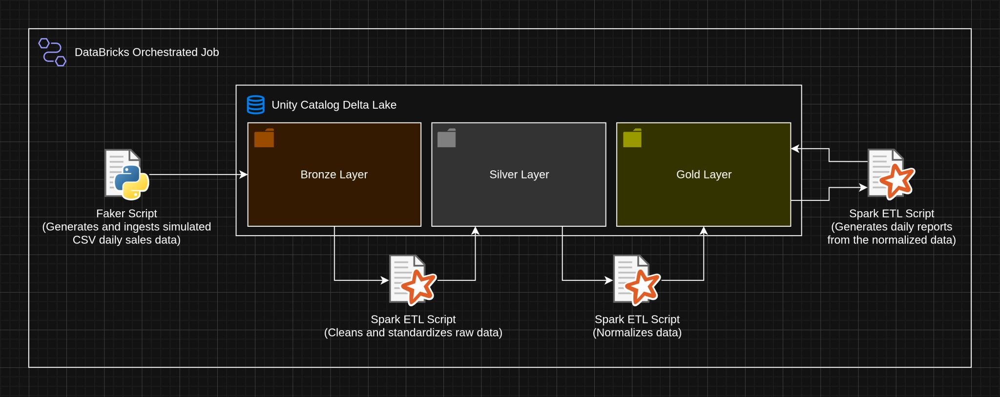
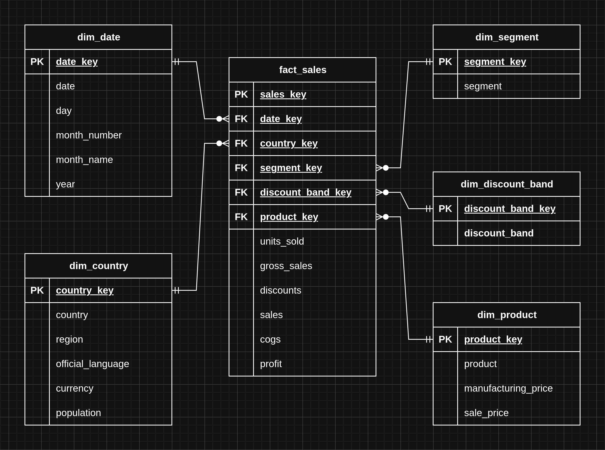
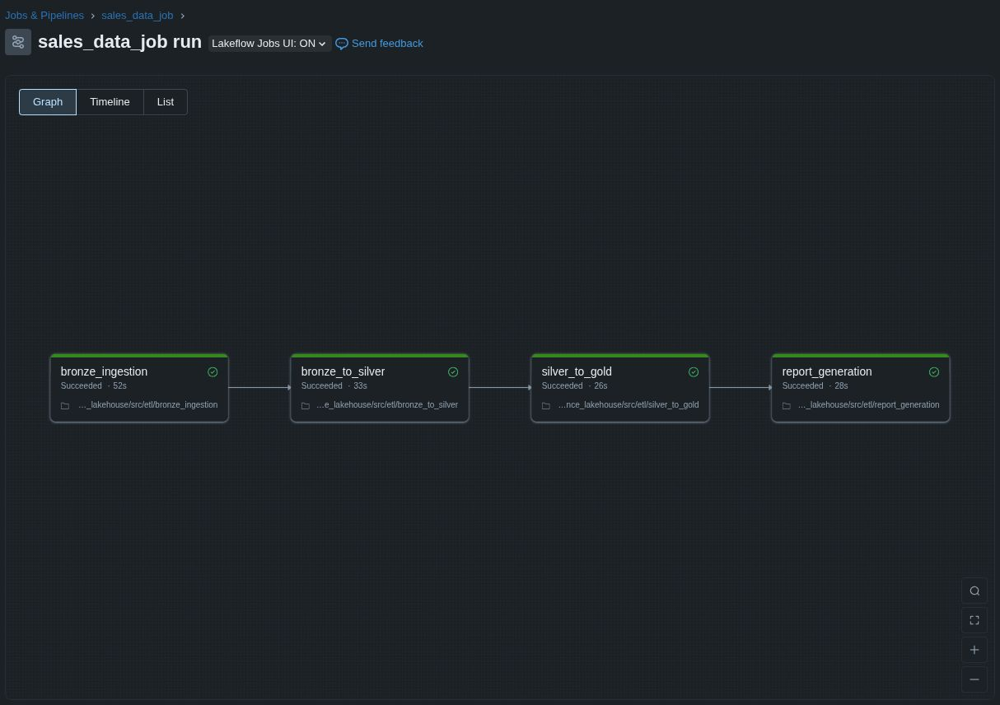

# Databricks Financial Data Lakehouse
O projeto se trata de uma pipeline ETL completa executada e automatizada na plataforma de dados [Databricks](https://www.databricks.com/br),

A pipeline é composta por 4 scripts ETL em [Python](https://docs.python.org/3/) responsáveis por extrair, processar e mover os dados entre as três camadas do Data Lakehouse estrtuturado de acordo com a [arquitetura medalhão](https://www.databricks.com/br/glossary/medallion-architecture)(camadas Bronze, Silver e Gold) no [Unity Catalog](https://www.databricks.com/br/product/unity-catalog). Todo esse processo foi automatizado e agendado utilizando [Jobs](https://docs.databricks.com/aws/pt/jobs/configure-job#gsc.tab=0).

Diagrama completo do projeto:

## Setup

Os scripts [00_create_catalog_schema.py](setup/00_create_catalog_schema.py) e [01_create_basic_directory_structure.py](setup/01_create_basic_directory_structure.py) servem para criar a estrutura básica do Data Lakehouse no Unity Catalog e devem ser executados manualmente uma vez antes da pipeline começar a ser executada para garantir o bom funcionamento da pipeline e do Data Lakehouse.

## Etapas

### 1. Script EL de criação e ingestão de dados simulados utilizando as bibliotecas `Faker` e `Random`

O primeiro script da pipeline é responsável por gerar e inserir dados diários simulados dentro da camada Bronze do Data Lakehouse em formato CSV, apesar dos dados serem simulados e aleatórios, o código que os gera faz com que as variáveis tenham certa coerência entre si além de inserir propositalmente alguns defeitos nos dados para serem tratados pelos outros scripts da pipeline, o que é importante para simular dados reais.

Código: [bronze_ingestion.py](src/etl/bronze_ingestion.py)

### 2. Script ETL de limpeza, padronização e adição de metadados

O segundo script da pipeline é responsável por extrair os dados do dia da camada Bronze, tratar defeitos encontrados nos dados, padronizar nomes de colunas, adicionar colunas de metadados sobre origem e data de processamento dos dados e carrega-los em formato [Parquet](https://en.wikipedia.org/wiki/Apache_Parquet) na camada Silver particionando-os pela coluna de data de processamento.

Código: [bronze_to_silver.py](src/etl/bronze_to_silver.py)

### 3. Script ETL de normalização de dados

O terceiro script da pipeline é responsável por criar um modelo dimensional para os dados separando-os em uma tabela `fato` e algumas outras tabelas `dimensão`, tornando os dados mais propícios para consultas analíticas.

Diagrama relacional do modelo dimensional criado:

Código: [silver_to_gold.py](src/etl/silver_to_gold.py)

### 4. Script ETL de geração de relatórios em CSV

O quarto e último script da pipeline é responsável por gerar relatórios sobre os dados do dia e exporta-los em formato CSV também na camada Gold.

### 5. Automação e agendamento da pipeline com um Job Databricks

Com todos os scripts prontos, a pipeline estava completa e foi possível automatizar e agendar a execução da pipeline na própria plataforma usando um Job Databricks, onde foi definida a ordem e dependencias entre os scripts da pipeline.

DAG da pipeline:
